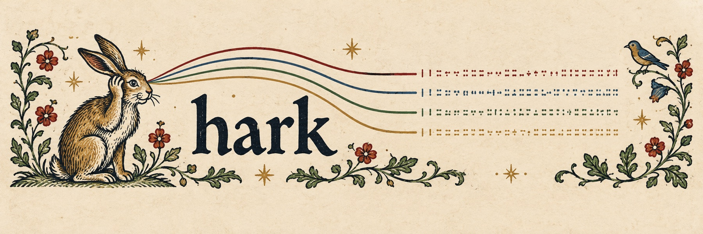

<p align="center">
  
</p>

# hark

**A live meeting transcript with speaker labels, written on your Mac to a plain text file that any agent can follow.**

```
# hark 2026-09-24 19:34 — call: me = mic, S1… = system audio
19:34:17 S1   Okay, let's get started. I want to go over the cosmic shear covariance
19:34:23 me   Sure, I reran the pipeline last night with the new masks
19:34:29 S2   Did anyone check whether the redshift distributions changed?
# ended 19:35:19
```

Run `hark` and talk. Each time someone finishes a turn, hark appends one line to the transcript, labelled with who said it. Your coding agent (Claude Code, Codex, pi, or a shell loop) reads the file as it grows, so it can take notes, answer when you address it, or pick up a task mid-meeting. There is no UI and no server, and nothing is uploaded: speech recognition and speaker diarization run locally on Apple Silicon via [MLX](https://github.com/ml-explore/mlx).

hark exists because dictation tools don't work well in meetings. They transcribe one voice at a time, don't separate speakers, and aren't built to run for an hour. hark does one job: turning a conversation into a file.

## Requirements

- A Mac with Apple Silicon, running macOS 14.2 or later (the system-audio tap needs it)
- [uv](https://docs.astral.sh/uv/) (it fetches Python 3.11–3.13 if needed) and the Swift toolchain (Xcode or the Command Line Tools)
- About 3 GB of disk for the models, which download from Hugging Face on first run

## Install

```bash
git clone https://github.com/cailmdaley/hark && cd hark
scripts/build-audiotee.sh   # builds the system-audio tap → bin/audiotee
uv sync
```

`scripts/build-audiotee.sh` builds [audiotee](https://github.com/makeusabrew/audiotee) at a pinned commit. It's a small Swift program that captures everything the Mac plays through a Core Audio process tap. Run hark with `uv run hark`, or link `.venv/bin/hark` somewhere on your `PATH`.

Grant two macOS permissions to the terminal that runs hark: **Microphone**, and **Screen & System Audio Recording → System Audio Recording Only**. Restart the terminal afterwards. If system audio stays silent for the first 20 s of a call, hark prints a reminder pointing at the second setting.

## Use

```bash
uv run hark                    # a call: your mic is "me", the call's audio is diarized S1…S8
uv run hark --room             # in person: the mic alone, diarized
uv run hark --file talk.m4a    # a recording, through the same streaming pipeline
uv run hark --title "telecon"  # names the session file
```

Press Ctrl-C to end the session. hark flushes the last turn and writes `# ended`.

**On a call, wear headphones.** In call mode hark assumes the mic hears only you and system audio holds everyone else. On speakers, the call leaks into the mic and gets attributed to you.

Transcripts go to `~/.hark/sessions/<date>_<time>[_title].txt`, and `~/.hark/current.txt` always points at the live one. A `.jsonl` file beside each transcript has the same utterances with timing and track.

## Plugging into an agent

The transcript file is the whole interface, so any agent that can read a file can follow a meeting.

**Claude Code.** Ask it to watch the transcript with the `Monitor` tool:

```
Monitor `tail -n +1 -F ~/.hark/current.txt` and follow the meeting. Take notes
in notes.md; if someone says your name, answer in the terminal.
```

Each new line arrives as an event. When a line starting with `# ended` arrives, the meeting is over.

**Harnesses without a monitor tool.** Poll by line count: remember how many lines you've read, and on each pass read from there with `tail -n +$((n+1)) ~/.hark/current.txt`. hark only ever appends, so line numbers are stable.

**Names.** Speakers start out anonymous (`S1`, `S2`, … in order of arrival). You or your agent can name one mid-meeting:

```bash
uv run hark name S2 "Ada"    # appends "# S2 = Ada"; later lines say Ada
```

Enroll voices ahead of time and hark names diarized speakers itself when it's confident:

```bash
uv run hark enroll Ada --seconds 30       # record Ada speaking into the mic for 30 s
uv run hark enroll Ada --file ada.wav     # or enroll from audio
```

An agent reading the transcript should apply the latest `# Sx = name` line for each slot, including to lines written before it.

## How it works

Two models from NVIDIA, both running in MLX through [mlx-audio](https://github.com/Blaizzy/mlx-audio):

- **Nemotron 3.5 streaming ASR** (`mlx-community/nemotron-3.5-asr-streaming-0.6b`) turns speech into words
- **Nemotron-3-Diarization** (`mlx-community/Nemotron-3-Diarization`) decides who is speaking in each 80 ms frame, for up to 8 speakers, with about a second of lookahead

The diarizer masks the audio features for each speaker, and each speaker gets their own ASR decoder, so words arrive already attributed. hark adds turn-taking on top: a line ends when someone else speaks for more than a moment (0.8 s), or after 3 s of silence. Brief backchannels ("mm-hm") don't cut someone off. It also watches its own inputs. If the system-audio tap dies mid-call, the transcript says so (`# system audio lost at 16:37:55 …`) rather than looking like a quiet meeting.

The docs go deeper:

- [docs/usage.md](docs/usage.md): every option, saved audio, logs, mirroring over SSH, and the lifecycle file for launchers
- [docs/format.md](docs/format.md): the text and JSONL formats, which are the contract for agents
- [docs/how-it-works.md](docs/how-it-works.md): the pipeline, turn segmentation, speaker masks, voice matching, and how to evaluate diarization

## Limitations

- macOS on Apple Silicon only.
- Diarization is good but not perfect. Expect the occasional mislabelled turn, and more of them when people talk over each other.
- Lines from different speakers can land slightly out of time order, because each speaker's turn closes on its own schedule.
- Speaker numbers are per session; the same person can be `S1` today and `S3` tomorrow unless their voice is enrolled.

## Development

```bash
uv run pytest
```

## License

MIT; see [LICENSE](LICENSE). The model weights and audiotee have their own licenses.
